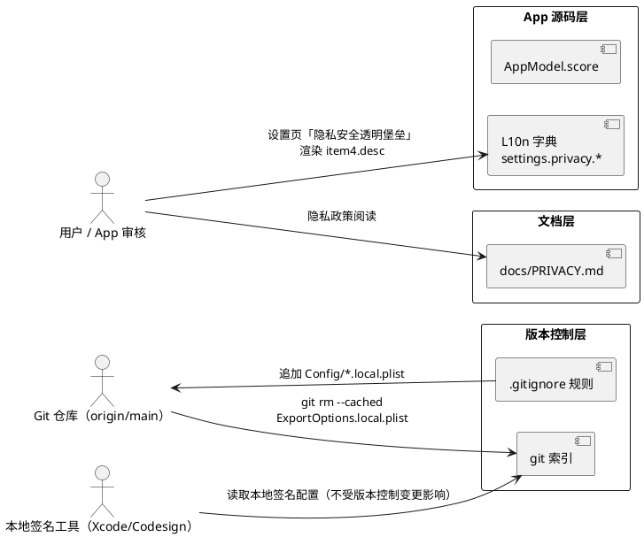
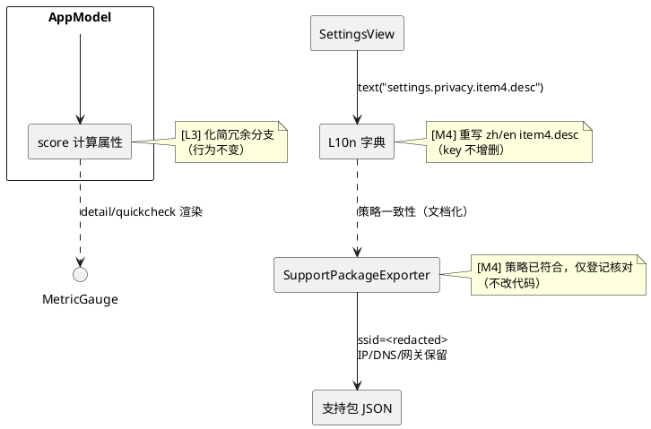

# 阶段一「即刻发版防线」实现方案设计（M2 / M4 / L3）

> 适用版本：v1.2（构建号 6），与 TC3 决议一致——阶段一任务不独立 hotfix，并入 v1.2 统一发布。
> 需求来源：`docs/PRD.md` §8.3 / §8.4 / §8.8 / §8.9；`docs/implementation-plan.md` M6.1；`docs/appstore-checklist.md`「阶段一：即刻发版防线」。
> 决策基线：commit `02ccefd`（TC1~TC6 全数闭环）；`main` 分支，`swift build` ✅ / `swift test` ✅（16 例全绿，0.007s）。
> 评审状态：Google AI（Antigravity）复核结论【通过 (Approved)】（2026-09-27，审核输入见 `google-ai-review-prompt.md`）；其 3 条优化建议已合入本文档与 tasks.md：① PRIVACY.md 日期戳同步至 2026-09；② T5 改用 `git diff HEAD` 维度级校验 L10n key 不增删；③ 验证命令统一改用 `git check-ignore -v` 回显规则行号。
> 变更红线：不可触碰 Bundle ID / Apple ID / SKU / Team ID / 上架显示名；不新增 entitlements；不新增数据收集类别（PRD §8.7）。

---

# 一、需求与存量功能关系分析

## 1.1 需求功能与存量功能对比

### 1.1.1 已实现功能

需求中直接可复用的既有能力，识别为无需改动或仅需增量调整的部分：

| 需求功能 | 存量功能 | 代码位置 | 匹配度 |
|---------|---------|---------|--------|
| [M2] 保留不含个人信息的签名模板 | `Config/ExportOptions.plist` 模板已存在（仅 method / teamID / uploadSymbols 三项通配值） | `Config/ExportOptions.plist` | 100% |
| [M4] SSID 占位脱敏的执行逻辑 | `SupportPackagePayload.redact(_:)` 将 `ssid` 替换为 `<redacted>`，IP/DNS/网关按设计完整保留 | `Sources/NetworkCore/SupportPackageExporter.swift:34-63` | 100% |
| [M4] SSID 空值"未获取"优雅占位 | `overview.notAvailable` 文案 8 语言全覆盖（zh「未获取」/ en「Not available」…），`localizedResolverSource` 已映射 | `Sources/NetworkConsoleApp/Localization.swift` zh:138 / en:389 等；`AppModel.swift:468-473` | 100% |
| [L3] `AppModel.score` 只读分数展示 | `score` 计算属性已实现并被 `DetailView` / `QuickCheckView` / `HealthScoreGaugeView` 渲染 | `Sources/NetworkConsoleApp/AppModel.swift:107-112`、`DetailView.swift:170`、`QuickCheckView.swift:42` | 100%（仅需内部化简，见 §1.1.2） |
| [M2] 本地签名配置管理策略 | 仓库既有 `.gitignore` 机制（含 `.build/`、`*.xcuserstate` 等规则） | `.gitignore`（仓库根） | 100%（需追加规则） |

### 1.1.2 需要扩展的功能

需求与存量功能部分匹配、需改造的部分：

| 需求功能 | 存量功能 | 差异说明 | 扩展方向 |
|---------|---------|---------|---------|
| [M4] 剔除"物理 MAC 脱敏"虚假承诺 | zh/en 的 `settings.privacy.item4.desc` 宣称对外“自动对 Wi-Fi SSID **与物理 MAC** 脱敏” | 代码**从未采集物理 MAC 地址**（采集面仅 `getifaddrs` 地址、SSID 等），该承诺不成立；且按 §8.4 沙盒现状 SSID 恒为 nil，实际脱敏对象为空 | 仅重写该 key 的字典值（zh/en），把承诺收窄为“SSID 占位 + IP/DNS/网关作为诊断字段保留”，key 数量不增删 |
| [M4] 导出策略与隐私声明一致 | `docs/PRIVACY.md` 导出段落仅表述“SSID 被脱敏”，未声明 IP/DNS/网关保留策略 | 声明不完整：审核追问“哪些字段脱敏”时无文档化依据；与 PRD §8.3 验收条件“导出结果与文档化策略一致”不完全对齐 | 增强 `docs/PRIVACY.md`（EN/中文各一节）导出策略表述，明确保留字段与占位字段的完整清单 |
| [L3] `AppModel.score` 冗余分支剔除 | 第 107-112 行 `if isChecking { return report?.score ?? 100 }` 与 `return report?.score ?? 100` 两个分支**表达式完全相同** | 无行为差异；冗余分支是在早期“检查中显示满分”逻辑被移除时残留的死结构 | 化简为单一表达式（点击与渲染行为完全不变），见 §2.1.3 |
| [M2] `.gitignore` 拦截 `.local` 签名变体 | 当前 `.gitignore` 未含 `Config/*.local.plist` 规则，`ExportOptions.local.plist` 已是 git 追踪文件 | 仅加规则不会自动解除追踪，必须 `git rm --cached` 先行 | 追加忽略规则 + 从索引移除，双步完成 |

### 1.1.3 需要新增的功能或接口

以下为本阶段**新增**的配置/文档项，业务代码层面**无新增接口**：

1. **`.gitignore` 规则**（配置新增）：新增 `Config/*.local.plist` 通配规则，拦截所有本地签名变体，避免未来再次入库。
2. **`docs/PRIVACY.md` 导出策略声明增强**（文档新增）：新增"保留字段 / 占位字段"两个明确列表，中英双语各一段。
3. **出口无新增**：无新 Swift 类型、无新 L10n key、无新公开接口（关键：保持 TC1 核实的 zh/en=248 基线不变，见 §1.2 约束）。

## 1.2 存量功能详细分析

### 1.2.1 `AppModel.score`（L3 改动目标）

- **接口契约**：`var score: Int`，只读计算属性；无入参、无副作用、无异常。
- **业务规则**：期望语义为“取最近一次诊断报告分数，无报告时回退 100”。现行实现为两个完全相同的分支，`if isChecking` 判断为无效复杂度。
- **调用方**：`DetailView.swift:170`、`QuickCheckView.swift:42`（均传入 `HealthScoreGaugeView`），以及 `CyberDiagnosisCardView.swift:58`（直接读 `report.score`，不走该属性）。化简不改变任何调用方可见行为。
- **约束**：`HealthGrade.checking` 时的显示值同样由 `report?.score ?? 100` 提供，不存在“检查中显示满分”的独立需求，可安全删并。

### 1.2.2 脱敏与隐私现状（M4 改动目标）

- **`SupportPackageExporter.redact(_:)`**（`SupportPackageExporter.swift:34-63`）：仅构造 `InterfaceInfo` 副本时把 `ssid` 置为 `"<redacted>"`（nil 保持 nil）；`addresses`（IPv4/IPv6）、`dns.servers`、`dns.searchDomains`、`routes` 全部 `report.dns` / `report.routes` **原样透传**。
- **实采集范围**：物理 MAC 从未被采集——`SystemCollectors.swift` 走 `NWPathMonitor` / `getifaddrs` / `SCDynamicStoreCopyValue`，无 Ethenet/BSD 硬件地址读取；因此“物理 MAC 脱敏”为纯文字虚构能力。
- **SSID 现状**：沙盒 entitlements（`Config/NetworkConsoleLite.entitlements`）未含 `com.apple.developer.networking.wifi-info`，`ssid()` 在 App Store 构建下恒返回 nil（PRD §8.4 刚性结论），界面与实际脱敏均以“未获取”兜底。
- **文案位点清单**（本次需修改的**唯一**运行时文案位点）：

| 语言 | key | 行号 | 现状 |
|------|-----|------|------|
| zh | `settings.privacy.item4.desc` | `Localization.swift:213` | 虚假承诺（含“物理 MAC”） |
| en | `settings.privacy.item4.desc` | `Localization.swift:464` | 虚假承诺（含“hardware MAC”） |

- **已准确、无需改用的近邻文案**：`settings.privacy.item4.title`（zh:212「智能脱敏导出」/ en:463）、`settings.privacy.redacted`（zh:238 / en:489，仅表述 SSID 脱敏 + 排除项，与事实一致）。
- **渲染位点**：`SettingsView.swift:336-386` `privacyFortressPod` 通过 `model.text("settings.privacy.item4.desc")` 渲染，无第二处引用，单点修改即全局生效。

### 1.2.3 `.gitignore` 与版本控制现状（M2 改动目标）

- **追踪事实**：`git ls-files Config/` 输出包含 `Config/ExportOptions.local.plist`；工作树干净（无未提交改动），意味着该文件自 commit `d7f7d9e` 起已入库。
- **敏感内容**：`teamID J84LGFK7GY`、`3rd Party Mac Developer Application: xukuo huang`、私密 provisioning profile 名。
- **历史残留说明**：`git rm --cached` 仅解除**当前索引**追踪，历史提交中仍含该文件内容。经验证本仓库为**私有仓库**，泄露面受控；彻底清洗历史需 `git filter-branch`/`filter-repo` 重写历史，属有风险操作，**本阶段不做**，仅文档登记风险提示，由仓库可见性策略兜底。
- **同等敏感未入库**：`Scripts/asc_token.py` 密钥均从环境变量读取，无硬编码（`docs/project-review-2026-09-27.md` §4），不入本轮范围。

### 1.2.4 存量约束与依赖识别

1. **TC1 key 计数约束**：zh/en 当前各 248 个 key（commit `747ddef` 后复核基线）。本阶段**只允许修改字典 value，不允许增删 key**，否则会漂移已核实的缺口基线、污染 TC1 结论与阶段二的 H1 工作量评估。
2. **兜底链约束**（PRD §8.1 需求 3）：字典查找链仍是 `dict → en → zh`，本阶段**不修正兜底链**（属阶段二 H1 范围），但 M4 文案修改不得依赖兜底链语义。
3. **测试约束**：现有 16 例测试全部针对 NetworkCore；`NetworkCoreTests` 中镇守的 verdict 断言（`XCTAssertEqual(verdict, "全链路畅通 · 状态极佳")` 一类）属阶段二 H3/H4 处理。本阶段三类改动均不触碰 NetworkCore 行为，**不应**导致任何测试改动。
4. **xcodegen 约束**：`project.yml` 无变动需求；改后执行 `xcodegen generate` 漂移校验维持无 diff。
5. **文档体系约束**：`docs/PRD.md`、`docs/project-review-2026-09-27.md`、`docs/ai-review-handoff-summary.md` 中对“物理 MAC”的引用属于**审计证据链**，保留不删；仅在**面向用户/审核的运行时文案与隐私声明**中剔除。

---

# 二、增量设计方案

## 2.1 实现模型

### 2.1.1 上下文视图

本阶段三项任务的交互边界非常清晰，均为**零运行时行为变更**的单点改动：



要点：

1. **M2 属于版本控制层变更**，不进入 App 二进制，不影响本地签名/归档流程（TC3 复核事实）。
2. **M4 属于文案层变更**，仅作用于设置页渲染与隐私文档，不改变导出数据内容（导出数据内容已符合新策略）。
3. **L3 属于源码层化简**，属性签名不变，UI 渲染路径不变。

### 2.1.2 服务/组件总体架构

本阶段**无新增组件、无新增模块、无新增依赖**。涉及的存量组件及改动边界如下：



配置项变更：`.gitignore` 追加 `Config/*.local.plist` 1 行规则（见 §2.1.3）；`project.yml` / `Package.swift` / entitlements / Info.plist **零改动**（红线校验）。

### 2.1.3 实现设计文档

#### (1) [M2] 签名配置移出版本控制 —— 命令级设计

改动位置：仓库根 `.gitignore` + git 索引。

执行序列（提交前的预期操作，属本方案唯一允许的执行命令）：

```bash
# 1) 从索引移除敏感文件（保留工作树本地文件，签名能力不受影响）
git rm --cached Config/ExportOptions.local.plist

# 2) .gitignore 追加规则（见下）
#   Config/*.local.plist

# 3) 一次事务提交
git add .gitignore
git commit -m "chore(security): untrack ExportOptions.local.plist and ignore *.local.plist variants"
```

状态断言（完成后验证）：

- `git ls-files Config/` **不再包含** `ExportOptions.local.plist`。
- 工作树中该文件**仍存在**（本地签名不受影响）。
- `git status` 显示该文件为未追踪（untracked）或已被忽略。

**分支策略**：建议在 `main` 直接执行（低风险；或用独立分支 `chore/stage1-release-guard` 提交后合入，按团队习惯二选一，本方案不强约束）。

#### (2) [L3] `AppModel.score` 冗余分支化简 —— 结构级设计

改动位置：`Sources/NetworkConsoleApp/AppModel.swift:107-112`。

现状结构（两分支字面相同）：

```swift
var score: Int {
    if isChecking {
        return report?.score ?? 100
    }
    return report?.score ?? 100
}
```

目标结构（直接返回单一表达式）：

```swift
var score: Int {
    report?.score ?? 100
}
```

设计要点：

- **同构证明**：`if isChecking` 两分支体均为 `report?.score ?? 100`，删除判断分支保持任意输入下输出不变（可置换为纯函数结论，行为零漂移）。
- **公开接口不变**：`var score: Int` 签名、访问级别、可读性均不变；`DetailView` / `QuickCheckView` / `HealthScoreGaugeView` 零改动。
- **不依赖 `isChecking`**：化简后枚举属性 `isChecking` 仍被其他 UI 状态消费（`statusTitle` / `summaryText` / `updateStatusSymbol`），无“死代码连带删除”风险。

#### (3) [M4] 文案与隐私声明对齐 —— 内容级设计

**3a. 运行时文案重写**（`Localization.swift`，key 不变、仅 value 变更）：

| key | 语言 | 现值（虚假承诺） | 目标值（策略准确） |
|-----|------|-----------------|-------------------|
| `settings.privacy.item4.desc` | zh | 支持包自动对 Wi-Fi SSID 与物理 MAC 脱敏 | 支持包导出对 SSID 做占位处理，IP、DNS 与网关等诊断字段按需保留 |
| `settings.privacy.item4.desc` | en | Support bundles automatically redact Wi-Fi SSIDs and hardware MAC addresses | Support export masks Wi-Fi SSIDs while keeping diagnostic fields such as IP addresses, DNS servers, and gateways |

近邻 key（`item4.title`、`settings.privacy.redacted`）与事实一致，**不修改**；其余 6 种语言本就无 `item4.*` key（TC1 缺口清单内，阶段二补齐），本阶段不新增。

**3b. `docs/PRIVACY.md` 策略声明增强 + 日期戳同步**：

在「Support Package Export / 支持包导出」段落追加保留字段与占位字段清单（EN/中文各一段）：

- 占位字段：Wi-Fi SSID（无法获取时显示“未获取 / Not available”）。
- 保留字段：接口 IP（IPv4/IPv6）、DNS 服务器、默认网关、连通性探测结果——作为网络诊断的必要数据保留。
- 排除字段（维持现值）：用户名、Cookie、密码、私钥、本地路径。

**日期戳同步（AG 建议①）**：文档头部 EN 段首行（第 3 行）`Last updated: August 15, 2026` 与中文段首行（第 32 行）`更新日期：2026年8月15日` 必须随本次修订一并更新为 `Last updated: September 27, 2026` / `更新日期：2026年9月27日`，保持「最近更新」声明与实际修订日期一致；此变更无审核风险，仅属文案日期维护。

**3c. 核对位点（不改代码）**：`Config/NetworkConsoleLite.xcconfig`、PrivacyInfo 声明与本方案无冲突，仅登记核对结论。

## 2.2 接口设计

### 2.2.1 总体设计

| 接口 | 分类 | 变更类型 | 稳定性等级 |
|------|------|---------|-----------|
| `AppModel.score: Int` | 视图数据源 | 内部实现化简，签名不变 | 稳定 |
| `L10n` 字典（`settings.privacy.item4.desc`） | 界面文案契约 | value 重写，key 不变 | 稳定 |
| 支持包导出 `schemaVersion` | 数据契约 | **无变更**，维持 1（对齐 TC5） | 稳定 |
| `SupportPackagePayload.redact(_:)` | 数据契约 | **无变更**（行为已符合策略） | 稳定 |

对外无新增接口、无破坏性变更；`NetworkCore` 与 `NetworkConsoleApp` 之间的模块接口零变化。

### 2.2.2 接口清单

本阶段无新增接口清单；以下为受影响的存量接口的契约说明：

1. **`var score: Int`（只读）**
   - 签名：`var score: Int`；入参无；出参：`0...100`（回退 `100`）。
   - 前置条件：无；后置条件：无副作用。
   - 异常映射：无抛出路径，无错误码。
2. **`L10n.string(_:language:)`**
   - 入参 key 字符串 + `AppLanguage`；出参本地化文本。
   - 变更规则：`settings.privacy.item4.desc` 的 zh/en value 重写后，`Localization.swift` zh/en 字典仍保持 248 key 一致（TC1 基线不回漂）。
   - 兜底行为：其它 6 语言继续按现链路回退英文，本次不触碰（阶段二 H1 修正兜底链）。

## 2.3 数据模型

### 2.3.1 设计目标

本阶段不引入任何新数据实体、新持久化字段或新存储格式。

### 2.3.2 模型一致性声明

- `DiagnosisReport` / `SupportPackagePayload` 的 Codable 结构与字段集**零变化**，支持包导出格式（`schemaVersion = 1`）维持 TC5 决议的向后兼容性。
- `AppSettings` 读写模型零变化。
- 隐私数据类目零新增（PRD §8.7 需求 3：v1.2 不新增数据收集类别）。

---

# 三、验证策略与完成定义

| 验证维度 | 方法 | 通过标准 |
|---------|------|---------|
| 编译 | `swift build` | Build complete，无 warning 增量 |
| 测试 | `swift test` | 16 例全绿（无新增、无改动） |
| 签名配置泄漏 | `git ls-files Config/` | 不含 `ExportOptions.local.plist` |
| ignore 生效 | `git check-ignore -v Config/ExportOptions.local.plist` | 回显匹配规则与行号（如 `.gitignore:26:Config/*.local.plist`），确证 `Config/*.local.plist` 规则生效 |
| 本地签名能力 | 工作树 `Config/ExportOptions.local.plist` 仍存在 | 文件存在、内容不变 |
| 虚假承诺清零 | `grep -n "物理 MAC\|hardware MAC\|physical MAC" Sources/` | 无命中（仅审计文档 docs/ 保留） |
| 隐私文档日期 | `grep -n "Last updated\|更新日期" docs/PRIVACY.md` | 显示 `September 27, 2026` / `2026年9月27日`（与本方案修订日期一致） |
| key 基线（不增删） | `git diff HEAD --numstat Sources/NetworkConsoleApp/Localization.swift`（提交前） | `2 2`：仅 zh/en 各 1 行 value 变更、0 行新增/删除；辅以 `git diff -U0 HEAD` 逐对核对 key 名不变 |
| 界面 | 运行 App，切换 zh / en 查看设置页第 4 柱 | 文案显示新策略表述，无英文残留 |
| 导出核对 | 导出支持包 | SSID 为 `<redacted>` 或 "未获取"，IP/DNS/网关保留 |
| 工程漂移 | `xcodegen generate` | 与现有 xcodeproj 无 diff |
| 红线 | 归档前校验 | Bundle ID / Apple ID / SKU 与上架记录一致，构建号 ≥ 6 |

**完成定义**（对齐 `implementation-plan`「每步完成定义」阶段一子项）：`ExportOptions.local.plist` 不在 git 索引中；文案虚假承诺清零；`swift build && swift test` 通过；提交并推送到 `origin/main`；`docs/implementation-plan.md` M6.1 与 `docs/appstore-checklist.md` 阶段一勾选状态同步更新。

**风险登记（不阻断本阶段）**：git 历史提交 `d7f7d9e` 中仍保留敏感文件内容；仓库为私有库，泄露面受控。如需彻底清洗需 `git filter-repo` 重写历史（会改变历史哈希，影响现有 clone），本阶段不做，列为阶段三 L8 前的专项决策项。