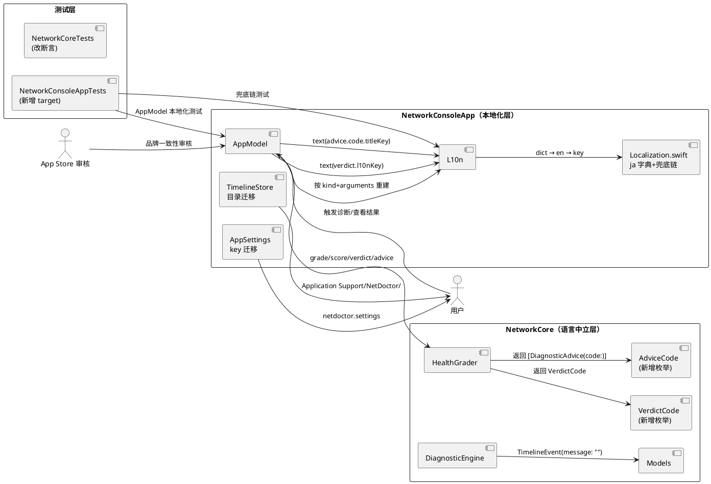
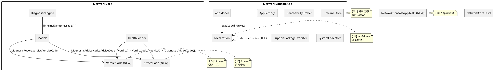

# 阶段二「v1.2 架构加固与品牌规范」实现方案设计（H3 / H4 / M1 / H1 第一批）

> 适用版本：v1.2（构建号 6），与 TC3 决议一致——阶段二任务并入 v1.2 统一发布。
> 需求来源：`docs/PRD.md` §8.1 / §8.2 / §8.5 / §8.6 / §8.9；`docs/implementation-plan.md` M6.2；`docs/appstore-checklist.md`「阶段二：架构加固与品牌规范」。
> 决策基线：commit `23f0396`（阶段一结项）；`main` 分支，`swift build` ✅ / `swift test` ✅（16 例全绿）。
> 变更红线：不可触碰 Bundle ID（`com.networkconsole.lite`）/ Apple ID（`6801707344`）/ SKU（`networkconsole-lite-0001`）/ Team ID（`J84LGFK7GY`）/ 上架显示名（`NetDoctor: Network Diagnostics`）；不新增 entitlements；不新增数据收集类别（PRD §8.7）。
> 评审状态：Google AI（Antigravity）复核结论【需微调通过 (Approved with Recommendations)】（2026-09-27）；提出 5 项关键架构微调建议（详见第四节），已整合至 tasks.md 与本文档正文。

---

# 一、需求与存量功能关系分析

## 1.1 需求功能与存量功能对比

### 1.1.1 已实现功能

需求中直接可复用的既有能力，识别为无需改动或仅需增量调整的部分：

| 需求功能 | 存量功能 | 代码位置 | 匹配度 |
|---------|---------|---------|--------|
| [H3] 诊断结论的语言中立载体 | `HealthGrade` 枚举已为 `String, Codable, Sendable`，`rawValue` 语言中立（`checking`/`healthy`/`warning`/`critical`） | `Models.swift:421-452` | 100%（作为 VerdictCode/AdviceCode 的设计范本） |
| [H3] TimelineEvent 结构化参数 | `TimelineEvent.arguments: [String]` 已携带语言中立值（status rawValue、count、latency） | `Models.swift:554-575` | 100%（arguments 已就绪，仅需 message 改为 kind+arguments 重建） |
| [H1] 兜底链框架 | `L10n.string(_:language:)` 已实现 dict 查找 + 兜底链 | `Localization.swift:88-103` | 框架就绪，仅需修正兜底链顺序 |
| [M1] 品牌名 NetDoctor 已在 L10n | `app.name` key 的 zh/en 值已为 `"NetDoctor"` | `Localization.swift:106` | 100%（L10n 层已完成，本轮处理代码层残留） |
| [H4] 测试基础设施 | `NetworkCoreTests` target 已存在，16 例全绿 | `Tests/NetworkCoreTests/` | 100%（作为新 target 的结构范本） |

### 1.1.2 需要扩展的功能

需求与存量功能部分匹配、需改造的部分：

| 需求功能 | 存量功能 | 差异说明 | 扩展方向 |
|---------|---------|---------|---------|
| [H3] verdict 返回类型化枚举 | `HealthGrader.verdict()` 返回 `String`，12 种中文硬编码 | App 层 `localizedVerdict` 用 12 个中文字符串做 switch 匹配 L10n key，脆弱且不可维护 | 新增 `VerdictCode` 枚举（12 case），verdict 返回 `VerdictCode`；App 层直接 `text(verdict.l10nKey)` |
| [H3] advice 返回类型化枚举 | `DiagnosticAdvice.title`/`message` 为 `String`，9 对中文硬编码 | App 层 `localizedAdvice` 用 9 对中英文字符串做 switch 匹配 | 新增 `AdviceCode` 枚举，`DiagnosticAdvice` 增加 `code: AdviceCode` 字段；App 层直接 `text(code.titleKey)`/`text(code.messageKey)` |
| [H3] summary/criticalReasons/warningReasons 中文硬编码 | `summary()` 返回中文，`criticalReasons`/`warningReasons` 返回中文片段 | App 层 `localizedSummary` 已按 `HealthGrade` 枚举映射 L10n key（不依赖中文匹配），但 NetworkCore 内的中文字符串仍违反语言中立原则 | summary 改为返回 `SummaryCode` 枚举或直接由 App 层按 `HealthGrade` 重建（已有 `localizedSummary` 实现）；reasons 改为结构化原因码列表 |
| [H3] TimelineEvent message 中文硬编码 | 3 处 message 含中文模板字符串 | arguments 已携带结构化参数，但 message 仍为中文插值 | message 改为语言中立模板标识（或空字符串），App 层按 `kind` + `arguments` 重建本地化 message |
| [H3] TimelineEventKind.displayName 中文硬编码 | 5 种 kind 的 displayName 返回中文 | App 层 `localizedTimelineEvents` 已有按 kind 映射 L10n 的逻辑 | displayName 改为返回 rawValue 或移除，App 层负责显示文本 |
| [H3] NetworkStatus/InterfaceKind/LinkState displayName 中文硬编码 | 3 个枚举的 displayName 返回中文 | 这些 displayName 被 DiagnosticEngine TimelineEvent message 插值使用 | H3 改造后 message 不再插值 displayName，displayName 可移除或改为返回 rawValue |
| [H1] 兜底链修正 | `dict[key] ?? en[key] ?? zh[key] ?? key` | zh 兜底导致非中文语言在 key 缺失时回退中文，违反 PRD §8.1 需求 3 | 修正为 `dict[key] ?? en[key] ?? key`（移除 zh 兜底） |
| [M1] User-Agent 品牌统一 | `"NetworkConsoleLite/1.0"` | 残牌残留，应统一为 NetDoctor | 改为 `"NetDoctor/1.2"` |
| [M1] 支持包文件名前缀 | `"NetworkConsoleLite-Support-*.json"` | 拋牌残留 | 改为 `"NetDoctor-Support-*.json"` |
| [M1] 存储目录名 | `Application Support/NetworkConsoleLite/` | 拋牌残留 + TC6 决策：启动时一次性安全搬迁 | 改为 `Application Support/NetDoctor/`；新增启动时迁移逻辑 |
| [M1] UserDefaults key 前缀 | `"networkConsoleLite.settings"` / `"networkConsoleLite.language"` | 拋牌残留 | 改为 `"netdoctor.settings"` / `"netdoctor.language"`；需读取旧 key 兼容迁移 |
| [M1] SCDynamicStore name | `"NetworkConsoleLite"` | 拋牌残留 | 改为 `"NetDoctor"` |
| [M1] Package.swift name | `"NetworkConsoleLite"` | 拋牌残留（不影响 Bundle ID） | 改为 `"NetDoctor"` |

### 1.1.3 需要新增的功能或接口

以下为本阶段**新增**的类型、接口与测试：

1. **`VerdictCode` 枚举**（H3 新增类型）：`String, Codable, Sendable, CaseIterable`，12 个 case，每个 case 提供 `var l10nKey: String` 计算属性返回对应 L10n key。**注**：`verdict.notChecked` 为 AppModel 专属 UI 兜底状态（`report == nil` 时消费），不纳入枚举；Localization.swift 13 个 `verdict.*` key 映射体系自洽。
2. **`AdviceCode` 枚举**（H3 新增类型）：`String, Codable, Sendable, CaseIterable`，9 个 case，每个 case 提供 `var titleKey: String` / `var messageKey: String` 计算属性。
3. **`DiagnosticAdvice.code` 字段**（H3 接口扩展）：新增 `code: AdviceCode` 字段，**保留** `title`/`message` 字段（AG 建议二，避免 UI 层编译中断）；NetworkCore 构造时 title/message 默认空串，App 层通过 code 填充本地化文本。
4. **`DiagnosisReport.verdict` 类型变更**（H3 接口变更）：`String` → `VerdictCode`。
5. **`NetworkConsoleAppTests` target**（H4 新增 target）：测试 App 层逻辑（AppModel 本地化映射、L10n 兜底链、品牌一致性等）。
6. **ja 字典 84 key 补齐**（H1 新增内容）：在 `Localization.swift` ja 字典中新增 84 个 key-value 对。
7. **存储目录迁移逻辑**（M1 新增行为）：App 启动时检测旧目录 `Application Support/NetworkConsoleLite/`，若存在则一次性安全搬迁至 `Application Support/NetDoctor/`。
8. **UserDefaults key 迁移逻辑**（M1 新增行为）：首次启动时检测旧 key `networkConsoleLite.*`，若存在则读取并写入新 key `netdoctor.*`。

## 1.2 存量功能详细分析

### 1.2.1 `HealthGrader.verdict()`（H3 改造目标）

- **接口契约**：`func verdict(grade:score:path:interfaces:dns:routes:reachability:) -> String`
- **现状**：返回 12 种中文字符串，按 grade + 子条件分支选择：
  - `.checking` → `"链路探测中（网络诊断中…）"`
  - `.critical` → 4 种子情况（链路中断/物理断开/出口受阻/严重异常）
  - `.warning` → 4 种子情况（解析异常/带宽受限/丢包抖动/延迟偏高）+ 兜底"局部异常"
  - `.healthy` → 2 种子情况（全链路畅通/连接稳定）
- **调用方**：`DiagnosticEngine.performCheck()` 第 152 行构造 `DiagnosisReport(verdict: verdict)`；`AppModel.localizedVerdict()` 第 396-425 行用 12 个中文字符串 switch 匹配 L10n key
- **脆弱性**：App 层 switch 匹配中文字符串——若 NetworkCore 修改任何中文措辞，App 层匹配断裂，verdict 显示原始中文而非本地化文本

### 1.2.2 `HealthGrader.advice()`（H3 改造目标）

- **接口契约**：`func advice(path:interfaces:dns:routes:reachability:) -> [DiagnosticAdvice]`
- **现状**：返回 `[DiagnosticAdvice]`，每条 advice 的 `title`/`message` 为中文硬编码，9 种 advice：
  1. 确认网络已连接 / 2. 启用网络接口 / 3. 检查 DNS 设置 / 4. 检查默认路由或 VPN / 5. 网络处于受限状态 / 6. 外网不可达 / 7. 部分外网站点不可达 / 8. 延迟偏高 / 9. 网络状态正常
- **调用方**：`DiagnosticEngine.performCheck()` 构造 `DiagnosisReport(advice: advice)`；`AppModel.localizedAdvice()` 第 472-515 行用 9 对中英文字符串 switch 匹配 L10n key
- **脆弱性**：同 verdict，中文字符串匹配

### 1.2.3 `HealthGrader.summary()` / `criticalReasons()` / `warningReasons()`（H3 改造目标）

- **接口契约**：`func summary(grade:path:interfaces:dns:routes:reachability:) -> String`
- **现状**：返回中文 summary；`criticalReasons`/`warningReasons` 返回 `[String]` 中文片段列表，用"；"拼接
- **调用方**：`DiagnosticEngine.performCheck()` 构造 `DiagnosisReport(summary: summary)`；`AppModel.localizedSummary()` 第 427-438 行**已按 `HealthGrade` 枚举映射** L10n key（不依赖中文匹配）
- **改造策略**：`localizedSummary` 已不依赖中文匹配，仅需将 NetworkCore 内的中文 summary 改为语言中立值（空字符串或枚举），App 层 `localizedSummary` 已可直接按 `HealthGrade` 重建

### 1.2.4 `DiagnosticEngine` TimelineEvent message（H3 改造目标）

- **现状**：3 处 TimelineEvent message 中文硬编码：
  1. 第 58 行：`"网络路径变化：\(path.status.displayName)"`（kind: `.pathChanged`）
  2. 第 78 行：`"开始网络诊断（\(endpoints.count) 个端点）"`（kind: `.checkStarted`）
  3. 第 169 行：`"检查完成：\(grade.displayName)，\(successCount)/\(probes.count) 可达，平均延迟 \(latencyText)"`（kind: `.checkFinished`）
- **arguments 已就绪**：每处均携带语言中立参数（rawValue、count、latencyText 等）
- **改造策略**：message 改为空字符串或 kind rawValue，App 层 `localizedTimelineEvents` 按 `kind` + `arguments` 重建本地化 message

### 1.2.5 `AppModel.localizedVerdict` / `localizedAdvice`（H3 改造目标）

- **`localizedVerdict`**（第 396-425 行）：12 个 `case "中文":` → `text("verdict.*")`，`default: return rawVerdict`
- **`localizedAdvice`**（第 472-515 行）：9 对 `case "中文", "English":` → `text("advice.*.title")` / `text("advice.*.message")`，`default: return advice`
- **改造后**：verdict 类型为 `VerdictCode`，直接 `text(verdict.l10nKey)`；advice 通过 `advice.code` 直接 `text(code.titleKey)` / `text(code.messageKey)` 填充 title/message，消除全部中文 switch 匹配。**联动 `CyberDiagnosisCardView.swift:71`**（AG 建议三）：`Text(report.verdict.isEmpty ? ...)` 改为 `Text(text(report.verdict.l10nKey))`；`AppModel.displayReport:392` 简化为 `verdict: report.verdict` 直接透传。

### 1.2.6 `L10n.string()` 兜底链（H1 改造目标）

- **现状**（第 102 行）：`return dict[key] ?? en[key] ?? zh[key] ?? key`
- **问题**：非中文语言在 key 缺失时回退到 zh（中文），导致日语/韩语/德语等用户看到中文文本
- **改造**：`return dict[key] ?? en[key] ?? key`（移除 zh 兜底，所有语言最终兜底一律为 en）
- **影响**：改后 ja 缺失的 84 key 将回退英文而非中文——因此必须先补齐 ja 84 key（H1 第一批），否则 ja 用户会看到英文回退

### 1.2.7 品牌残留位点清单（M1 改造目标）

| 文件 | 行号 | 现状 | 目标 |
|------|------|------|------|
| `ReachabilityProber.swift` | 85 | `"NetworkConsoleLite/1.0"` | `"NetDoctor/1.2"` |
| `SupportPackageExporter.swift` | 114 | `"NetworkConsoleLite-Support-*.json"` | `"NetDoctor-Support-*.json"` |
| `TimelineStore.swift` | 56 | `Application Support/NetworkConsoleLite/timeline.jsonl` | `Application Support/NetDoctor/timeline.jsonl` + 迁移逻辑 |
| `AppSettings.swift` | 22, 32 | `"networkConsoleLite.settings"` | `"netdoctor.settings"` + 迁移逻辑 |
| `AppModel.swift` | 211, 568 | `"networkConsoleLite.language"` | `"netdoctor.language"` + 迁移逻辑 |
| `NetworkConsoleApp.swift` | 5 | `struct NetworkConsoleLiteApp` | `struct NetDoctorApp` |
| `SystemCollectors.swift` | 140, 165 | `"NetworkConsoleLite"` (SCDynamicStore name) | `"NetDoctor"` |
| `Package.swift` | 5 | `name: "NetworkConsoleLite"` | `name: "NetDoctor"` |

### 1.2.8 存量约束与依赖识别

1. **TC1 key 计数约束**：zh/en=248，ja=164（缺 84），ko/de/fr/es/pt=131（各缺 117）。本阶段 H1 第一批补齐 ja 84 key 后 ja=248；兜底链修正不改 key 数量。ko/de/fr/es/pt 缺口留待阶段三。
2. **Codable 兼容性约束**：`DiagnosisReport.verdict` 从 `String` 改为 `VerdictCode`（`String` rawValue），Codable 编解码兼容（rawValue 一致）。`DiagnosticAdvice` **保留** title/message 字段（AG 建议二），新增 `code` 字段；旧 JSON（有 title/message 无 code）可平滑回退（code 缺失 → `.unknown`，title/message 保留原值），100% 向后兼容。支持包 `schemaVersion` 维持 1（TC5 决策）。
3. **测试约束**：`NetworkCoreTests` 中 3 处中文断言（第 172/225/251-253 行）需同步改为枚举断言。H4 新增 `NetworkConsoleAppTests` target 需在 `Package.swift` 注册。
4. **xcodegen 约束**：`project.yml` 需同步新增 test target 引用（若 xcodegen 管理测试 target）。
5. **品牌迁移安全性**：TC6 决策——时间线目录迁移采用"启动时一次性安全搬迁"。需确保：(a) 新目录不存在时才迁移；(b) 迁移失败不阻断启动；(c) 迁移后旧目录可安全删除（但不自动删，留给用户）。
6. **UserDefaults 迁移安全性**：读取旧 key 值写入新 key 后，不删除旧 key（避免降级回退时丢失设置）；仅在旧 key 存在且新 key 不存在时迁移（一次性）。

---

# 二、增量设计方案

## 2.1 实现模型

### 2.1.1 上下文视图



### 2.1.2 服务/组件总体架构



### 2.1.3 实现设计文档

#### (1) [H3] VerdictCode 枚举设计

**新增类型**（`Models.swift` 或独立 `VerdictCode.swift`）：

```swift
public enum VerdictCode: String, Codable, Sendable, CaseIterable {
    case checking
    case optimal          // 全链路畅通 · 状态极佳
    case good             // 连接稳定 · 运行正常
    case dnsSlow          // 解析异常
    case constrained      // 带宽受限
    case jitterLoss       // 丢包抖动
    case highLatency      // 延迟偏高
    case warningDefault   // 局部异常
    case offline          // 链路中断
    case noInterface      // 物理断开
    case allProbesFailed  // 出口受阻
    case criticalDefault  // 严重异常

    public var l10nKey: String {
        switch self {
        case .checking:         return "verdict.checking"
        case .optimal:          return "verdict.optimal"
        case .good:             return "verdict.good"
        case .dnsSlow:          return "verdict.dnsSlow"
        case .constrained:      return "verdict.constrained"
        case .jitterLoss:       return "verdict.jitterLoss"
        case .highLatency:      return "verdict.highLatency"
        case .warningDefault:   return "verdict.warningDefault"
        case .offline:          return "verdict.offline"
        case .noInterface:      return "verdict.noInterface"
        case .allProbesFailed:  return "verdict.allProbesFailed"
        case .criticalDefault:  return "verdict.criticalDefault"
        }
    }
}
```

**HealthGrader.verdict 改造**：返回类型 `String` → `VerdictCode`，内部 switch 逻辑不变，仅将 `return "中文"` 替换为 `return .enumCase`。

**DiagnosisReport.verdict 改造**：`var verdict: String` → `var verdict: VerdictCode`。Codable 兼容：`VerdictCode` 为 `String` rawValue，编解码与原 String 一致（前提：rawValue 与原中文不同——**不兼容旧支持包**）。**决策**：支持包 `schemaVersion` 维持 1，但 verdict 字段在支持包中改为存储 `verdict.rawValue`（枚举名），不存储中文。旧支持包（含中文 verdict）解码时 `VerdictCode(rawValue: "中文")` 返回 nil → 需提供 `verdictFallback` 或 `init(from decoder:)` 容错。

**AppModel.localizedVerdict 改造**：

```swift
// 改造前：12 个中文字符串 switch
func localizedVerdict(_ rawVerdict: String) -> String { ... }

// 改造后：直接按枚举映射
func localizedVerdict(_ verdict: VerdictCode) -> String {
    text(verdict.l10nKey)
}
```

#### (2) [H3] AdviceCode 枚举设计

**新增类型**：

```swift
public enum AdviceCode: String, Codable, Sendable, CaseIterable {
    case confirmConnection
    case enableInterface
    case checkDNS
    case checkRoute
    case constrained
    case unreachable
    case partialUnreachable
    case highLatency
    case healthy

    public var titleKey: String {
        "advice.\(rawValue).title"
    }
    public var messageKey: String {
        "advice.\(rawValue).message"
    }
}
```

**DiagnosticAdvice 改造**：

```swift
public struct DiagnosticAdvice: Identifiable, Codable, Equatable, Sendable {
    public let id: UUID
    public let code: AdviceCode        // 新增
    public let title: String           // 保留（AG 建议二，避免 UI 层编译中断）
    public let message: String         // 保留
    public let severity: HealthGrade
    // NetworkCore 构造时 title/message 默认空串；App 层 localizedAdvice 按 code 填充本地化文本

    public init(id: UUID = UUID(), code: AdviceCode, title: String = "", message: String = "", severity: HealthGrade) {
        self.id = id
        self.code = code
        self.title = title
        self.message = message
        self.severity = severity
    }
}
```

**Codable 兼容**：`code` 为非可选——旧支持包（无 code 字段）解码失败。**决策**：提供自定义 `init(from decoder:)` 容错，`code` 缺失时回退 `.healthy`（或新增 `.unknown` case）；或 `code` 设为可选 `AdviceCode?`。推荐：新增 `.unknown` case 作为解码兜底。

**HealthGrader.advice 改造**：每处 `DiagnosticAdvice(title:message:severity:)` 改为 `DiagnosticAdvice(code:severity:)`（title/message 默认空串）。

**AppModel.localizedAdvice 改造**：

```swift
// 改造前：9 对中英文 switch
private func localizedAdvice(_ advice: DiagnosticAdvice) -> DiagnosticAdvice { ... }

// 改造后：按 code 填充 title/message（AG 建议二：保留字段，UI 视图零改动）
private func localizedAdvice(_ advice: DiagnosticAdvice) -> DiagnosticAdvice {
    DiagnosticAdvice(
        id: advice.id,
        code: advice.code,
        title: text(advice.code.titleKey),
        message: text(advice.code.messageKey),
        severity: advice.severity
    )
}
```

#### (3) [H3] summary / reasons / TimelineEvent message 改造

**summary 改造**：`HealthGrader.summary()` 返回 `String` → 返回空字符串或移除（App 层 `localizedSummary` 已按 `HealthGrade` 枚举重建）。**决策**：`summary()` 保留但返回空字符串（`DiagnosisReport.summary` 字段保留以维持 Codable 兼容），App 层 `localizedSummary` 已不依赖该值。

**criticalReasons / warningReasons 改造**：这两个私有方法仅被 `summary()` 调用，改造后 `summary()` 返回空字符串，可移除或保留为死代码（推荐移除，减少中文残留）。

**TimelineEvent message 改造**：3 处 message 改为空字符串 `""`，arguments 保持不变。App 层 `localizedTimelineEvents` 按 `kind` + `arguments` 重建本地化 message（已有该方法的框架，需扩展按 kind 重建逻辑）。

**TimelineEventKind.displayName / NetworkStatus.displayName / InterfaceKind.displayName / LinkState.displayName 改造**：这些 displayName 返回中文，改造后：
- `TimelineEventKind.displayName`：移除或改为 `return rawValue`（App 层已有按 kind 映射 L10n 的逻辑）
- `NetworkStatus.displayName` / `InterfaceKind.displayName` / `LinkState.displayName`：H3 改造后 TimelineEvent message 不再插值这些 displayName，但它们可能被其他地方使用——需排查调用方。若仅被 TimelineEvent message 使用，可移除；若有其他调用方，改为返回 rawValue 并由 App 层本地化。

#### (4) [H4] NetworkConsoleAppTests target 设计

**Package.swift 改造**：

```swift
.testTarget(
    name: "NetworkConsoleAppTests",
    dependencies: ["NetworkConsoleApp", "NetworkCore"]
),
```

**测试范围**（App 层无状态纯逻辑与模型层，**不实例化 AppKit/SwiftUI 视图层**——AG 建议五，避免主运行循环缺失引发偶发断言）：
1. `AppModel.localizedVerdict` 测试：每种 `VerdictCode` 映射到正确 L10n key
2. `AppModel.localizedAdvice` 测试：每种 `AdviceCode` 映射到正确 L10n key
3. `L10n.string` 兜底链测试：key 存在于 dict → 返回 dict 值；key 不存在于 dict 但存在于 en → 返回 en 值；key 不存在于 dict 和 en → 返回 key 本身；**不回退 zh**
4. `L10n.string` ja 全覆盖测试：ja 字典所有 key 在 en 中均存在（无孤儿 key）
5. 品牌一致性测试：User-Agent / 支持包文件名 / 存储目录 / UserDefaults key 均含 "NetDoctor" 或 "netdoctor"，不含 "NetworkConsoleLite" / "networkConsoleLite"
6. 存储目录迁移测试：旧目录存在 → 迁移至新目录；新目录已存在 → 不迁移；迁移失败 → 不崩溃

#### (5) [M1] 品牌统一设计

**代码层品牌残留改造**（8 处位点，见 §1.2.7 清单）：

- `ReachabilityProber.swift:85`：User-Agent `"NetworkConsoleLite/1.0"` → `"NetDoctor/1.2"`
- `SupportPackageExporter.swift:114`：suggestedFilename 前缀 → `"NetDoctor-Support-*.json"`
- `TimelineStore.swift:56`：defaultFileURL 目录 → `Application Support/NetDoctor/timeline.jsonl` + 启动时迁移逻辑
- `AppSettings.swift:22,32`：UserDefaults key → `"netdoctor.settings"` + 迁移逻辑
- `AppModel.swift:211,568`：UserDefaults key → `"netdoctor.language"` + 迁移逻辑
- `NetworkConsoleApp.swift:5`：struct 名 → `NetDoctorApp`
- `SystemCollectors.swift:140,165`：SCDynamicStore name → `"NetDoctor"`
- `Package.swift:5`：package name → `"NetDoctor"`

**存储目录迁移逻辑**（TC6 决策 + AG 建议四加固二级文件粒度保护）：

```swift
// TimelineStore 或 App 启动时
func migrateLegacyDirectoryIfNeeded() {
    let fm = FileManager.default
    guard let appSupport = fm.urls(for: .applicationSupportDirectory, in: .userDomainMask).first else { return }
    let oldDir = appSupport.appendingPathComponent("NetworkConsoleLite")
    let newDir = appSupport.appendingPathComponent("NetDoctor")
    guard fm.fileExists(atPath: oldDir.path) else { return }      // 旧目录不存在 → 不迁移
    if !fm.fileExists(atPath: newDir.path) {
        try? fm.moveItem(at: oldDir, to: newDir)                   // 新目录不存在 → 整目录搬迁
    } else {
        // 新目录已存在（可能为空）→ 二级文件粒度迁移保护（AG 建议四）
        let oldFile = oldDir.appendingPathComponent("timeline.jsonl")
        let newFile = newDir.appendingPathComponent("timeline.jsonl")
        if fm.fileExists(atPath: oldFile.path) && !fm.fileExists(atPath: newFile.path) {
            try? fm.moveItem(at: oldFile, to: newFile)             // 单独搬迁 timeline.jsonl，避免旧数据永久抛弃
        }
    }
}
```

**UserDefaults key 迁移逻辑**：

```swift
func migrateLegacySettingsIfNeeded() {
    let defaults = UserDefaults.standard
    let oldKey = "networkConsoleLite.settings"
    let newKey = "netdoctor.settings"
    if let oldValue = defaults.object(forKey: oldKey), defaults.object(forKey: newKey) == nil {
        defaults.set(oldValue, forKey: newKey)
    }
    // 同理处理 language key
}
```

#### (6) [H1 第一批] ja 字典补齐 + 兜底链修正

**ja 84 key 补齐**：在 `Localization.swift` ja 字典中新增 84 个 key-value 对，value 为日语翻译。84 key 清单（已由工具核实）涵盖：
- `verdict.*`（13 key）：诊断结论
- `advice.*.title` / `advice.*.message`（18 key）：排查建议
- `settings.privacy.*`（8 key）：隐私堡垒
- `settings.engine.*` / `settings.auto.*` / `settings.timeout.*` / `settings.endpoints.*` / `settings.ecosystem.*` / `settings.presenterdeck.*`（14 key）：设置页
- `dnsRoute.dns.*` / `dnsRoute.route.*`（19 key）：DNS 与路由
- `interfaces.telemetry.*` / `interfaces.copied`（8 key）：网络接口
- `quick.bento.*`（4 key）：快捷窗口
- `reachability.chart.*`（2 key）：连通性图表
- `timeline.filter.*` / `timeline.filterEmpty.*`（6 key）：时间线
- `detail.copyCard`（1 key）：详情页

**兜底链修正**（`Localization.swift:102`）：

```swift
// 改造前
return dict[key] ?? en[key] ?? zh[key] ?? key

// 改造后
return dict[key] ?? en[key] ?? key
```

**顺序约束**：必须先补齐 ja 84 key 再修正兜底链，否则修正后 ja 用户立即看到英文回退。两步在同一提交中完成。

## 2.2 接口设计

### 2.2.1 总体设计

| 接口 | 分类 | 变更类型 | 稳定性等级 |
|------|------|---------|-----------|
| `HealthGrader.verdict()` | NetworkCore 公开接口 | 返回类型 `String` → `VerdictCode` | **破坏性**（需同步改调用方） |
| `HealthGrader.advice()` | NetworkCore 公开接口 | 返回元素 `DiagnosticAdvice` 结构变更 | **破坏性** |
| `HealthGrader.summary()` | NetworkCore 公开接口 | 返回空字符串（语义移至 App 层） | 行为变更 |
| `DiagnosisReport.verdict` | 数据模型 | `String` → `VerdictCode` | **破坏性**（Codable 需容错） |
| `DiagnosticAdvice` | 数据模型 | 新增 `code: AdviceCode`，保留 `title`/`message`（默认空串，AG 建议二） | 向后兼容（Codable 容错） |
| `TimelineEvent.message` | 数据模型 | 改为空字符串（App 层按 kind+arguments 重建） | 行为变更 |
| `L10n.string()` | App 内部接口 | 兜底链修正（移除 zh 兜底） | 行为变更 |
| `Package.swift` | 构建配置 | 新增 `NetworkConsoleAppTests` target；package name 改为 `NetDoctor` | 构建变更 |
| 品牌字符串 | 多处 | `NetworkConsoleLite` → `NetDoctor` | 行为变更 |

### 2.2.2 接口清单

1. **`VerdictCode`（新增）**
   - 签名：`enum VerdictCode: String, Codable, Sendable, CaseIterable`
   - 12 case + `var l10nKey: String`
   - Codable：rawValue 为枚举名（语言中立）

2. **`AdviceCode`（新增）**
   - 签名：`enum AdviceCode: String, Codable, Sendable, CaseIterable`
   - 9 case + `.unknown`（解码兜底）+ `var titleKey: String` + `var messageKey: String`

3. **`DiagnosticAdvice`（变更）**
   - 新增 `code: AdviceCode`；**保留** `title: String` / `message: String`（AG 建议二，默认空串）
   - 自定义 `init(from decoder:)` 容错旧 JSON（无 code 字段 → `.unknown`，有 title/message → 保留原值）

4. **`DiagnosisReport.verdict`（变更）**
   - `String` → `VerdictCode`
   - 自定义 `init(from decoder:)` 容错旧 JSON（中文 verdict → nil → `.checking` 兜底）

5. **`HealthGrader.verdict()`（变更）**
   - 返回 `VerdictCode`；内部 switch 逻辑不变

6. **`HealthGrader.advice()`（变更）**
   - 返回 `[DiagnosticAdvice]`，每条含 `code`，title/message 默认空串（App 层按 code 填充本地化文本）

## 2.3 数据模型

### 2.3.1 设计目标

- 诊断结论与排查建议实现语言中立编码（枚举 rawValue）
- 支持包 Codable 兼容旧格式（verdict/advice 字段解码容错）
- 存储目录与 UserDefaults key 品牌统一

### 2.3.2 模型一致性声明

- `DiagnosisReport`：`verdict` 类型变更，`summary` 语义变更（空字符串），`advice` 元素结构变更。支持包 `schemaVersion` 维持 1（TC5 决策），自定义解码容错。
- `DiagnosticAdvice`：**保留** `title`/`message`（默认空串，AG 建议二），新增 `code`。自定义解码容错旧 JSON（无 code → `.unknown`，有 title/message → 保留原值，向后兼容）。
- `TimelineEvent`：`message` 改为空字符串，`arguments` 不变。App 层按 `kind` + `arguments` 重建。
- `AppSettings`：UserDefaults key 变更，启动时一次性迁移。
- 隐私数据类目零新增（PRD §8.7）。

---

# 三、验证策略与完成定义

| 验证维度 | 方法 | 通过标准 |
|---------|------|---------|
| 编译 | `swift build` | Build complete，无 warning 增量 |
| 测试（NetworkCore） | `swift test --filter NetworkCoreTests` | 全绿（中文断言改为枚举断言） |
| 测试（App 新增） | `swift test --filter NetworkConsoleAppTests` | 全绿（本地化映射/兜底链/品牌一致性/迁移逻辑） |
| 测试（全量） | `swift test` | 全绿 |
| H3 类型化 | `grep -n "VerdictCode\|AdviceCode" Sources/` | 新类型存在且被使用 |
| H3 中文 switch 消除 | `grep -n 'case ".*[\u4e00-\u9fff]' Sources/NetworkConsoleApp/AppModel.swift` | 零命中（App 层无中文 switch 匹配） |
| H3 NetworkCore 中文残留 | `grep -n '[\u4e00-\u9fff]' Sources/NetworkCore/HealthGrader.swift Sources/NetworkCore/DiagnosticEngine.swift` | 零命中或仅注释 |
| H4 测试 target | `swift test --filter NetworkConsoleAppTests` | target 存在且测试执行 |
| H1 ja key 补齐 | Python 脚本统计 ja 字典 key 数 | ja=248（与 zh/en 一致） |
| H1 兜底链 | `grep -n "zh\[key\]" Sources/NetworkConsoleApp/Localization.swift` | 零命中（zh 兜底已移除） |
| H1 无中文泄漏 | `swift test --filter NetworkConsoleAppTests` 兜底链测试 | 非中文语言 key 缺失 → 回退 en，不回退 zh |
| M1 品牌残留 | `grep -rn "NetworkConsoleLite\|networkConsoleLite" Sources/` | 零命中（仅 `docs/` 审计文档保留） |
| M1 User-Agent | `grep -n "NetDoctor" Sources/NetworkCore/ReachabilityProber.swift` | 命中 |
| M1 存储目录 | `grep -n "NetDoctor" Sources/NetworkCore/TimelineStore.swift` | 命中 |
| M1 UserDefaults key | `grep -n "netdoctor" Sources/NetworkConsoleApp/AppSettings.swift Sources/NetworkConsoleApp/AppModel.swift` | 命中 |
| 工程漂移 | `xcodegen generate` | 与现有 xcodeproj 无 diff |
| 红线 | 归档前校验 | Bundle ID / Apple ID / SKU / Team ID / 上架显示名不变；entitlements 不变 |

**完成定义**（对齐 `implementation-plan`「每步完成定义」阶段二子项）：
1. `HealthGrader.verdict()` 返回 `VerdictCode`，`advice()` 返回含 `AdviceCode` 的 `DiagnosticAdvice`，App 层无中文 switch 匹配。
2. `NetworkConsoleAppTests` target 存在且测试全绿。
3. 品牌字符串统一为 NetDoctor/netdoctor，代码层零 `NetworkConsoleLite` 残牌残留。
4. ja 字典 248 key 与 zh/en 一致，兜底链为 `dict → en → key`（无 zh 兜底）。
5. `swift build && swift test` 通过；提交并推送到 `origin/main`。
6. `docs/implementation-plan.md` M6.2 与 `docs/appstore-checklist.md` 阶段二勾选状态同步更新。

**风险登记**：
1. `DiagnosisReport.verdict` Codable 破坏性变更 → 自定义 `init(from decoder:)` 容错旧支持包；`schemaVersion` 维持 1（TC5）。`DiagnosticAdvice` 保留 title/message（AG 建议二），旧 JSON 向后兼容，无破坏性变更。
2. 存储目录迁移失败 → 不阻断启动，记录日志，用户可手动迁移。
3. UserDefaults key 迁移后旧 key 残留 → 不删除旧 key（降级兼容），仅在旧 key 有值且新 key 无值时迁移。
4. H3 改造涉及 NetworkCore 公开接口变更 → 需同步改 `NetworkCoreTests` 中文断言为枚举断言。
5. `Package.swift` package name 变更 → 确认不影响 xcodegen `project.yml` 引用（xcodegen 引用 target name 而非 package name）。

---

# 四、Google AI (Antigravity) 架构复核意见与修改建议

> 复核日期：2026-09-27  
> 总体结论：**【需微调通过 (Approved with Recommendations)】**  
> 阶段二设计总体逻辑清晰、架构分工明确，严格遵守不可变标识、沙盒及本地化 key 基线等硬性约束。但在具体接口契约与 UI 调用方联动细节上，存在 4 项需在落地前明确的微调建议，以避免编译中断与运行时异常。

---

## 4.1 核心复核发现与修改建议

### 建议一：修正 `VerdictCode` 枚举数量统计并厘清 `verdict.notChecked` 归属
- **现状分析**：
  - 文档正文（§1.1.3 第 1 项、§2.1.2、§2.2.2 第 1 项）与 `tasks.md:15, 30` 均记录为“11 case”。
  - 但实际列出的枚举定义（§2.1.3(1)）与 `HealthGrader.verdict()` 现存分支为 **12 个 case**（`checking`, `optimal`, `good`, `dnsSlow`, `constrained`, `jitterLoss`, `highLatency`, `warningDefault`, `offline`, `noInterface`, `allProbesFailed`, `criticalDefault`）。
  - 本地化字典中有 13 个 `verdict.*` key，其中 `verdict.notChecked` 是在 `report == nil` 时由 App 层（`AppModel.swift:116`）直接消费的缺省文案，并不由 NetworkCore 的 `verdict()` 生成。
- **修改建议**：
  - 文档全文修正为“**12 case 枚举**”。
  - 显式注明 `verdict.notChecked` 为 AppModel 专属 UI 兜底状态，保持与 `Localization.swift` 13 个 key 映射体系完全清晰自洽。

---

### 建议二：`DiagnosticAdvice` 保留 `title` 与 `message` 字段，避免破坏 UI 层渲染
- **现状分析**：
  - §2.1.3(2) 与 `tasks.md:54` 提出：“DiagnosticAdvice 移除 title/message，新增 code: AdviceCode”。
  - 但全局检索发现，`QuickCheckView.swift:128, 130` 与 `DetailView.swift:264, 266` 直接通过 `Text(advice.title)` 和 `Text(advice.message)` 进行渲染，且 `tasks.md` 的 T3 改动文件并未包含这两个视图文件。
  - 若从 `DiagnosticAdvice` 中直接物理移除 `title`/`message`，UI 层将立刻产生编译中断。
- **修改建议（兼顾中立性与兼容性最佳实践）**：
  1. `DiagnosticAdvice` **保留** `public let title: String` 与 `public let message: String`，同时新增 `public let code: AdviceCode`。
  2. 在 `NetworkCore` 中，`HealthGrader.advice()` 构造时仅需传入 `code: AdviceCode` 与 `severity`，`title` 与 `message` 默认为空字符串 `""`，彻底达成 NetworkCore 语言中立。
  3. 在 `NetworkConsoleApp` 中，`AppModel.localizedAdvice(...)` 负责根据 `advice.code` 调用 `text(code.titleKey)` 与 `text(code.messageKey)` 填充 `title` 与 `message`。
  4. **收益**：UI 视图（`QuickCheckView` / `DetailView`）零改动；旧版本支持包 JSON（含 title/message）解码可平滑回退，100% 向后兼容。

---

### 建议三：`DiagnosisReport.verdict` 类型化需联动 `CyberDiagnosisCardView.swift`
- **现状分析**：
  - `DiagnosisReport.verdict` 若从 `String` 改为 `VerdictCode`：
    - `CyberDiagnosisCardView.swift:71` 中包含代码 `Text(report.verdict.isEmpty ? text("card.verdict.normal") : report.verdict)`，因 `VerdictCode` 无 `isEmpty` 属性会导致编译报错。
    - `AppModel.displayReport:392` 目前为 `verdict: localizedVerdict(report.verdict)`，无法将本地化 `String` 直接赋值给 `VerdictCode` 属性。
- **修改建议**：
  1. `CyberDiagnosisCardView.swift:71` 联动修改为：`Text(text(report.verdict.l10nKey))`。
  2. `AppModel.displayReport:392` 简化为直接透传：`verdict: report.verdict`（本地化职责归于视图层 `text(report.verdict.l10nKey)` 或 `model.verdictText`）。
  3. 将 `CyberDiagnosisCardView.swift` 明确补充进 `tasks.md` 的 T3 改动文件列表。

---

### 建议四：加固 `TimelineStore` 目录搬迁逻辑（避免空新目录导致旧数据遗漏）
- **现状分析**：
  - §2.1.3(5) 与 `tasks.md:132` 提出的迁移判断为：“`guard fm.fileExists(atPath: oldDir.path) else { return }` 与 `if fm.fileExists(atPath: newDir.path) { return }`”。
  - **边界风险**：若用户因重装或系统机制使 `NetDoctor/` 目录已被提前建立（但为空目录，无 `timeline.jsonl`），此时直接 `return` 将导致原 `NetworkConsoleLite/timeline.jsonl` 被永久抛弃。
- **修改建议**：
  - 增加二级文件粒度迁移保护：
    ```swift
    if !fm.fileExists(atPath: newDir.path) {
        try? fm.moveItem(at: oldDir, to: newDir)
    } else {
        let oldFile = oldDir.appendingPathComponent("timeline.jsonl")
        let newFile = newDir.appendingPathComponent("timeline.jsonl")
        if fm.fileExists(atPath: oldFile.path) && !fm.fileExists(atPath: newFile.path) {
            try? fm.moveItem(at: oldFile, to: newFile)
        }
    }
    ```
  - 确保极端场景下用户的历史时间线事件依然 100% 完整搬迁。

---

### 建议五：`NetworkConsoleAppTests` 针对可执行目标的工程规范
- **说明**：`NetworkConsoleApp` 在 `Package.swift` 中为 `.executableTarget`，基于 `@main` 实现。为保证跨命令行 `swift test` 与 Xcode 运行时的绝对稳定性：
  - 测试范围严控于无状态纯逻辑与模型层（L10n 兜底链、`VerdictCode`/`AdviceCode` 映射、品牌常量与 `AppSettings` 迁移）。
  - 切勿在单测中尝试实例化 AppKit/SwiftUI 视图层，以避免因主运行循环缺失引发的偶发断言。

---

## 4.2 审查结论总结

以上 5 条优化建议均属于“防编译中断、防旧数据遗失、防 UI 破坏”的实现级加固，**无需改变阶段二的核心架构设计与任务拆分排期**。建议在合入上述修正后，即可进入阶段二的编码落地！