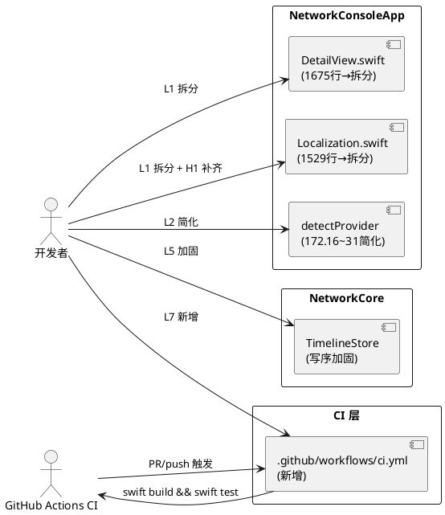
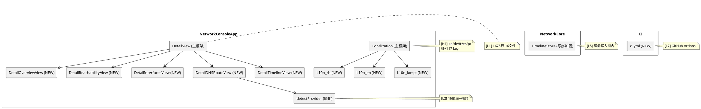

# 阶段三「v1.3 持续完善」实现方案设计（H1 第二批 / L1 / L2 / L5 / L7）

> 适用版本：v1.3（构建号 7），不阻塞 v1.2 发布；阶段三独立版本迭代。
> 需求来源：`docs/PRD.md` §8.1 / §8.8 / §8.9；`docs/implementation-plan.md` M6.3；`docs/appstore-checklist.md`「v1.3 后续自检」。
> 决策基线：commit `9609826`（阶段二结项）；`main` 分支，`swift build` ✅ / `swift test` ✅ 全绿。
> 变更红线：不可触碰 Bundle ID（`com.networkconsole.lite`）/ Apple ID（`6801707344`）/ SKU（`networkconsole-lite-0001`）/ Team ID（`J84LGFK7GY`）/ 上架显示名（`NetDoctor: Network Diagnostics`）；不新增 entitlements；不新增数据收集类别；不调用 Process/NSTask/Shell；支持包 SchemaVersion 维持 1（TC5）；zh/en/ja 248 key 基线不漂移。

---

# 一、需求与存量功能关系分析

## 1.1 需求功能与存量功能对比

### 1.1.1 已实现功能

| 需求功能 | 存量功能 | 代码位置 | 匹配度 |
|---------|---------|---------|--------|
| [H1] 兜底链已修正 | `L10n.string()` 兜底链已在阶段二修正为 `dict → en → key` | `Localization.swift:102` | 100%（阶段三不改兜底链） |
| [H1] ja 已补齐 | ja 字典已在阶段二补齐 84 key，达 248 全覆盖 | `Localization.swift` ja 字典 | 100% |
| [H1] L10n 完整性测试 | `NetworkConsoleAppTests` 已在阶段二建立，含兜底链/品牌一致性测试 | `Tests/NetworkConsoleAppTests/` | 100%（需扩展覆盖 ko/de/fr/es/pt） |
| [L5] TimelineStore 锁机制 | `TimelineStore` 已有 `NSLock` 保护内存 `events` 数组 | `TimelineStore.swift:4,20-26` | 框架就绪，仅需将磁盘写移入锁内 |
| [L7] 测试套件就绪 | `swift build && swift test` 本地全绿，16+ 例测试 | `Tests/` | 100%（CI 仅需包装执行） |

### 1.1.2 需要扩展的功能

| 需求功能 | 存量功能 | 差异说明 | 扩展方向 |
|---------|---------|---------|---------|
| [H1 第二批] ko/de/fr/es/pt 补齐 | 5 种语言各 131 key，各缺 117 key | 缺口已由 TC1 核实并经阶段二提交后重新确认不变 | 在 5 种语言字典中各新增 117 个 key-value 对，达 248 全覆盖 |
| [L1] DetailView.swift 拆分 | 1675 行，13 个 struct/enum 集中于一文件 | 超大文件可维护性差，但公开接口（`DetailView` struct）不变 | 按模块拆分为多文件（Overview/Reachability/Interfaces/DNSRoute/Timeline 等） |
| [L1] Localization.swift 拆分 | 1529 行，8 种语言字典集中于一文件 | 超大文件，但 `L10n`/`AppLanguage` 公开接口不变 | 按语言拆分为多文件（zh/en/ja/ko/de/fr/es/pt 各一文件）或按模块拆分 |
| [L2] detectProvider 私网判断 | 172.16.~172.31. 逐条罗列 16 个 `starts(with:)` 调用 | 冗长且低效，可用位运算/掩码简化 | 改用 CIDR 掩码判断或 `ip.starts(with: "172.")` + 二级 octet 范围判断 |
| [L5] TimelineStore 写序加固 | `append` 在 `lock.unlock()` 后执行磁盘写 | 多线程并发时磁盘 JSONL 行序可能乱序 | 将磁盘写移入锁内，或使用串行 `DispatchQueue` |
| [L7] GitHub Actions CI | 无 CI 配置，构建/测试仅靠本地手动执行 | PR 合入前无自动化质量门禁 | 新增 `.github/workflows/ci.yml`，执行 `swift build && swift test` + L10n 完整性检查 |

### 1.1.3 需要新增的功能或接口

1. **ko/de/fr/es/pt 各 117 key**（H1 第二批新增内容）：在 `Localization.swift` 5 种语言字典中各新增 117 个 key-value 对，总计 585 个新 key-value。
2. **DetailView 拆分后的子文件**（L1 新增文件）：按模块拆分为 6~8 个文件，如 `DetailView.swift`（主框架）+ `DetailOverviewView.swift` + `DetailReachabilityView.swift` + `DetailInterfacesView.swift` + `DetailDNSRouteView.swift` + `DetailTimelineView.swift` 等。
3. **Localization 拆分后的子文件**（L1 新增文件）：按语言拆分为 8 个文件，如 `Localization.swift`（`L10n`/`AppLanguage` 主框架）+ `L10n_zh.swift` + `L10n_en.swift` + ... 或按模块拆分。
4. **`.github/workflows/ci.yml`**（L7 新增配置）：GitHub Actions CI 流水线配置。
5. **出口无新增公开接口**：L1 拆分为纯重构（internal struct 拆文件），不改变公开接口；L2/L5 为内部实现优化。

## 1.2 存量功能详细分析

### 1.2.1 ko/de/fr/es/pt 缺口分析（H1 第二批）

- **缺口基数**：经阶段二提交 `9609826` 后重新统计确认，ko/de/fr/es/pt 各 131 key，各缺 117 key，与 TC1 基数一致（未漂移）。
- **117 key 按前缀分类**（以 ko 为例，其余 4 种语言缺口 key 集合完全相同）：

| 前缀 | key 数 | 说明 |
|------|--------|------|
| `settings.*` | 29 | 设置页（引擎/自动化/超时/端点/隐私/生态/演示台） |
| `dnsRoute.*` | 26 | DNS 与路由（DNS 提供商/路由卡片/筛选器/复制） |
| `card.*` | 16 | 诊断卡片（网格指标/标头/判决） |
| `verdict.*` | 13 | 诊断结论（12 枚举 + notChecked 兜底） |
| `interfaces.*` | 8 | 网络接口（遥测/复制） |
| `timeline.*` | 6 | 时间线（筛选器/空状态） |
| `quick.*` | 5 | 快捷窗口（Bento 指标卡） |
| `pipeline.*` | 4 | 拓扑链路管线 |
| `time.*` | 4 | 时间相关 |
| `reachability.*` | 3 | 连通性（图表） |
| `common.*` | 1 | 通用（复制目标） |
| `detail.*` | 1 | 详情页（复制卡片） |
| `gauge.*` | 1 | 仪表盘 |
| **合计** | **117** | |

- **翻译策略**：5 种语言 × 117 key = 585 key-value 对。可借助机器翻译初稿 + 人工校对；技术性 key（如 `dnsRoute.dns.provider.google` → "Google Public DNS"）可保持品牌名不变。
- **不改项**：zh/en/ja 字典不变（248 key 基线不漂移）；兜底链不变（已在阶段二修正为 `dict → en → key`）。

### 1.2.2 DetailView.swift 结构分析（L1 拆分目标）

- **文件行数**：1675 行，13 个 struct/enum：
  - `DetailTab`（enum，22 行）
  - `DetailView`（主 struct，132 行）
  - `OverviewView`（142 行）
  - `ReachabilityView`（119 行）
  - `MetricLine`（17 行）
  - `InterfacesView`（36 行）
  - `InterfaceTelemetryPod`（89 行）
  - `InterfaceBladeCard`（216 行）
  - `DNSRouteView`（244 行）
  - `DNSServerCard`（117 行，含 `detectProvider`）
  - `DefaultRouteHeroCard`（120 行）
  - `RouteExpresswayCard`（112 行）
  - `TimelineView`（160 行）
  - `TimelineRailwayItem`（144 行）
- **拆分原则**：公开接口（`DetailView` struct + `DetailTab` enum）不变；私有 struct 按模块分文件；`detectProvider` 随 `DNSServerCard` 迁移或提取为独立工具函数。
- **拆分方案**（建议 6 个文件）：
  1. `DetailView.swift`（主框架：`DetailTab` + `DetailView`，~160 行）
  2. `DetailOverviewView.swift`（`OverviewView` + `MetricLine`，~160 行）
  3. `DetailReachabilityView.swift`（`ReachabilityView`，~120 行）
  4. `DetailInterfacesView.swift`（`InterfacesView` + `InterfaceTelemetryPod` + `InterfaceBladeCard`，~340 行）
  5. `DetailDNSRouteView.swift`（`DNSRouteView` + `DNSServerCard` + `DefaultRouteHeroCard` + `RouteExpresswayCard` + `detectProvider`，~600 行）
  6. `DetailTimelineView.swift`（`TimelineView` + `TimelineRailwayItem`，~310 行）

### 1.2.3 Localization.swift 结构分析（L1 拆分目标）

- **文件行数**：1529 行，包含 `AppLanguage` 枚举（~85 行）+ `L10n` 枚举（~1444 行，含 8 种语言字典 + 兜底链逻辑）。
- **拆分原则**：`L10n.string()` / `AppLanguage` 公开接口不变；字典数据按语言分文件。
- **拆分方案**（建议 9 个文件）：
  1. `Localization.swift`（主框架：`AppLanguage` + `L10n` 枚举骨架 + `string()` 方法，~100 行）
  2. `L10n_zh.swift`（zh 字典，~250 行）
  3. `L10n_en.swift`（en 字典，~250 行）
  4. `L10n_ja.swift`（ja 字典，~250 行）
  5. `L10n_ko.swift`（ko 字典，~250 行）
  6. `L10n_de.swift`（de 字典，~250 行）
  7. `L10n_fr.swift`（fr 字典，~250 行）
  8. `L10n_es.swift`（es 字典，~250 行）
  9. `L10n_pt.swift`（pt 字典，~250 行）
- **实现方式**：字典声明为 `L10n` 的 `static` 属性，分文件用 `extension L10n` 提供。

### 1.2.4 detectProvider 私网判断分析（L2 改造目标）

- **现状**（`DetailView.swift:1131`）：
  ```swift
  ip.starts(with: "192.168.") || ip.starts(with: "10.") ||
  ip.starts(with: "172.16.") || ip.starts(with: "172.17.") || ... || ip.starts(with: "172.31.") ||
  ip.starts(with: "fe80:")
  ```
- **问题**：172.16.~172.31. 逐条罗列 16 个 `starts(with:)` 调用，冗长且低效。
- **改造方案**（两种可选）：
  - **方案 A（推荐）**：`ip.starts(with: "172.")` + 二级 octet 范围判断（解析第二段，判断 16...31）
  - **方案 B**：CIDR 掩码判断（将 IP 转为 `UInt32`，用掩码判断 172.16.0.0/12）
- **不改项**：`detectProvider` 的返回类型与调用方不变；公网 DNS 提供商判断（8.8.8.8 / 1.1.1.1 等）不变。

### 1.2.5 TimelineStore.append 写序分析（L5 改造目标）

- **现状**（`TimelineStore.swift:19-31`）：
  ```swift
  public func append(_ event: TimelineEvent) {
      lock.lock()
      events.append(event)
      // ... trim ...
      let line = try? Self.encoder.encode(event)
      lock.unlock()                    // ← 锁在这里释放

      if let line, let fileURL {
          Self.appendLine(line, to: fileURL)  // ← 磁盘写在锁外
      }
  }
  ```
- **问题**：线程 A 和 B 同时调用 `append`，A 先获锁编码后释放，B 获锁编码后释放；A 和 B 的磁盘写无锁保护，可能 B 先写入 → JSONL 行序与内存 `events` 数组不一致。
- **改造方案**（两种可选）：
  - **方案 A（推荐）**：将磁盘写移入锁内（`appendLine` 在 `unlock()` 之前执行）
  - **方案 B**：使用串行 `DispatchQueue` 替代 `NSLock`，所有读写操作在串行队列中执行
- **影响**：方案 A 增加锁持有时间（磁盘 I/O 阻塞），但 `append` 调用频率低（诊断事件），可接受；方案 B 改动更大但更优雅。
- **不改项**：`append` 公开接口不变；`allEvents` / `load` 不变；`migrateLegacyDirectoryIfNeeded` 不变。

### 1.2.6 CI 现状分析（L7 改造目标）

- **现状**：无 `.github/workflows/` 目录，构建/测试仅靠本地手动执行。
- **改造**：新增 `.github/workflows/ci.yml`，在 PR 和 push 时自动执行：
  1. `swift build`
  2. `swift test`
  3. L10n 完整性检查（zh/en/ja 248 key 基线 + ko/de/fr/es/pt 覆盖率报告）
- **约束**：CI 配置不得泄露密钥（`APP_STORE_CONNECT_API_KEY_PATH` 等从环境变量读取，不入 CI）；CI 仅执行构建/测试，不执行签名/上传。
- **运行环境**：macOS-latest（SwiftPM 需 macOS SDK）。

### 1.2.7 存量约束与依赖识别

1. **TC1 key 计数约束**：zh/en/ja=248（阶段二基线），ko/de/fr/es/pt=131（各缺 117）。阶段三补齐后 8 语言均达 248。缺口基数经阶段二提交后重新确认不变。
2. **兜底链约束**：已在阶段二修正为 `dict → en → key`，阶段三不改。
3. **L1 拆分约束**：纯重构，不改变公开接口与行为；`swift build` + `swift test` 全绿；xcodegen 无漂移。
4. **L2 改造约束**：`detectProvider` 返回类型不变，调用方不变。
5. **L5 改造约束**：`append` 公开接口不变；磁盘写序保证 JSONL 行序与内存 `events` 一致。
6. **L7 CI 约束**：不泄露密钥；不执行签名/上传；仅构建/测试。
7. **测试约束**：无真实网络依赖（mock 注入）；不实例化 AppKit/SwiftUI 视图层（阶段二 AG 建议五）。
8. **xcodegen 约束**：L1 新增文件需在 `project.yml` 中注册（若 xcodegen 管理 Sources 目录则自动包含）。

---

# 二、增量设计方案

## 2.1 实现模型

### 2.1.1 上下文视图



### 2.1.2 服务/组件总体架构



### 2.1.3 实现设计文档

#### (1) [H1 第二批] ko/de/fr/es/pt 补齐 117 key

**改动位置**：`Sources/NetworkConsoleApp/Localization.swift`（5 种语言字典各新增 117 个 key-value 对）。

**改动内容**：
- ko 字典：新增 117 个 key-value 对，value 为韩语翻译。
- de 字典：新增 117 个 key-value 对，value 为德语翻译。
- fr 字典：新增 117 个 key-value 对，value 为法语翻译。
- es 字典：新增 117 个 key-value 对，value 为西班牙语翻译。
- pt 字典：新增 117 个 key-value 对，value 为葡萄牙语翻译。
- 总计 585 个新 key-value 对。

**翻译策略**：
- 技术性 key（如 `dnsRoute.dns.provider.google` → "Google Public DNS"）保持品牌名不变。
- 系统路径引用（如 "系统设置 > 网络"）按各语言 macOS 系统设置实际名称翻译。
- 可借助机器翻译初稿 + 人工校对。

**不改项**：zh/en/ja 字典不变；兜底链不变。

#### (2) [L1] DetailView.swift 拆分

**改动位置**：`Sources/NetworkConsoleApp/DetailView.swift` → 拆分为 6 个文件。

**拆分方案**：
1. `DetailView.swift`（保留：`DetailTab` enum + `DetailView` struct 主框架，~160 行）
2. `DetailOverviewView.swift`（新增：`OverviewView` + `MetricLine`，~160 行）
3. `DetailReachabilityView.swift`（新增：`ReachabilityView`，~120 行）
4. `DetailInterfacesView.swift`（新增：`InterfacesView` + `InterfaceTelemetryPod` + `InterfaceBladeCard`，~340 行）
5. `DetailDNSRouteView.swift`（新增：`DNSRouteView` + `DNSServerCard` + `DefaultRouteHeroCard` + `RouteExpresswayCard` + `detectProvider`，~600 行）
6. `DetailTimelineView.swift`（新增：`TimelineView` + `TimelineRailwayItem`，~310 行）

**约束**：所有 struct 的 `private` 访问级别不变（跨文件需改为 `internal` 或 `fileprivate` → 实际上 Swift 同 module 内 `private` 仅文件内可见，拆分后需改为 `internal` 或使用 `fileprivate` + friend access pattern。**决策**：改为 `internal`（同 module 内可见，不影响公开 API，因 module 为 `NetworkConsoleApp` executable target，不对外暴露）。

#### (3) [L1] Localization.swift 拆分

**改动位置**：`Sources/NetworkConsoleApp/Localization.swift` → 拆分为 9 个文件。

**拆分方案**：
1. `Localization.swift`（保留：`AppLanguage` enum + `L10n` enum 骨架 + `string()` 方法，~100 行）
2. `L10n_zh.swift`（新增：`extension L10n { static let zh: [String: String] = [...] }`，~250 行）
3. `L10n_en.swift`（新增：同上，~250 行）
4. `L10n_ja.swift`（新增：同上，~250 行）
5. `L10n_ko.swift`（新增：同上，~250 行）
6. `L10n_de.swift`（新增：同上，~250 行）
7. `L10n_fr.swift`（新增：同上，~250 行）
8. `L10n_es.swift`（新增：同上，~250 行）
9. `L10n_pt.swift`（新增：同上，~250 行）

**实现方式**：字典声明为 `L10n` 的 `private static` 属性，分文件用 `private extension L10n` 提供（同 module 内可见）。

#### (4) [L2] detectProvider 私网判断简化

**改动位置**：`Sources/NetworkConsoleApp/DetailView.swift:1131`（拆分后迁移至 `DetailDNSRouteView.swift`）。

**改造方案**（方案 A：前缀 + 二级 octet 范围）：

```swift
// 改造前：16 个 starts(with:) 逐条罗列
ip.starts(with: "172.16.") || ip.starts(with: "172.17.") || ... || ip.starts(with: "172.31.")

// 改造后：前缀 + 二级 octet 范围判断
private func isPrivateIPv4(_ ip: String) -> Bool {
    if ip.starts(with: "192.168.") || ip.starts(with: "10.") {
        return true
    }
    if ip.starts(with: "172.") {
        // 解析第二段 octet，判断 16...31
        let octets = ip.split(separator: ".")
        if octets.count >= 2, let second = Int(octets[1]), 16...31 ~= second {
            return true
        }
    }
    return false
}
```

**不改项**：公网 DNS 提供商判断（8.8.8.8 / 1.1.1.1 等）不变；`detectProvider` 返回类型不变。

#### (5) [L5] TimelineStore.append 写序加固

**改动位置**：`Sources/NetworkCore/TimelineStore.swift:19-31`。

**改造方案**（方案 A：磁盘写移入锁内）：

```swift
// 改造前
public func append(_ event: TimelineEvent) {
    lock.lock()
    events.append(event)
    if events.count > maximumStoredEvents {
        events.removeFirst(events.count - maximumStoredEvents)
    }
    let line = try? Self.encoder.encode(event)
    lock.unlock()                    // ← 锁释放

    if let line, let fileURL {
        Self.appendLine(line, to: fileURL)  // ← 磁盘写在锁外
    }
}

// 改造后
public func append(_ event: TimelineEvent) {
    lock.lock()
    defer { lock.unlock() }
    events.append(event)
    if events.count > maximumStoredEvents {
        events.removeFirst(events.count - maximumStoredEvents)
    }
    if let fileURL {
        let line = try? Self.encoder.encode(event)
        if let line {
            Self.appendLine(line, to: fileURL)  // ← 磁盘写在锁内
        }
    }
}
```

**影响**：锁持有时间增加（含磁盘 I/O），但 `append` 调用频率低（诊断事件），可接受。

**不改项**：`append` 公开接口不变；`allEvents` / `load` 不变。

#### (6) [L7] GitHub Actions CI

**改动位置**：`.github/workflows/ci.yml`（新建）。

**配置内容**：

```yaml
name: CI
on:
  push:
    branches: [main]
  pull_request:
    branches: [main]

jobs:
  build-and-test:
    runs-on: macos-latest
    steps:
      - uses: actions/checkout@v4
      - name: Build
        run: swift build
      - name: Test
        run: swift test
      - name: L10n completeness
        run: |
          # 检查 zh/en/ja 各 248 key，ko/de/fr/es/pt 各 248 key（阶段三补齐后）
          python3 Scripts/check_l10n_completeness.py
```

**约束**：
- 不泄露密钥（不引用 `APP_STORE_CONNECT_API_KEY_PATH` 等环境变量）。
- 仅执行构建/测试，不执行签名/上传。
- 运行环境：`macos-latest`（SwiftPM 需 macOS SDK）。

**L10n 完整性检查脚本**（`Scripts/check_l10n_completeness.py`，新建）：
- 统计 8 种语言各 key 数量。
- 断言 zh/en/ja/ko/de/fr/es/pt 均 248 key。
- 输出缺口报告（若有）。

## 2.2 接口设计

### 2.2.1 总体设计

| 接口 | 分类 | 变更类型 | 稳定性等级 |
|------|------|---------|-----------|
| `L10n` 字典（ko/de/fr/es/pt） | 界面文案契约 | 各新增 117 key-value | 稳定（纯增量） |
| `DetailView` 及子 struct | UI 组件 | L1 拆分文件，`private` → `internal` | 稳定（同 module 内可见性变更） |
| `L10n` / `AppLanguage` | 本地化框架 | L1 拆分文件，字典分文件 | 稳定（公开接口不变） |
| `detectProvider` | 私有方法 | L2 简化实现 | 稳定（签名不变） |
| `TimelineStore.append` | 公开接口 | L5 磁盘写移入锁内 | 稳定（签名不变） |
| `.github/workflows/ci.yml` | CI 配置 | L7 新增 | 新增 |

### 2.2.2 接口清单

本阶段无新增公开接口；以下为受影响的存量接口：

1. **`L10n.string(_:language:)`**：兜底链不变（`dict → en → key`）；5 种语言字典扩充 117 key。
2. **`TimelineStore.append(_:)`**：签名不变；内部实现磁盘写移入锁内。
3. **`detectProvider(_:)`**：签名不变；内部私网判断简化。

## 2.3 数据模型

### 2.3.1 设计目标

- 8 语言 L10n key 全覆盖（各 248 key，缺口清零）
- 超大文件拆分提升可维护性
- 私网判断简化提升可读性
- 磁盘写序加固保证 JSONL 行序一致性
- CI 自动化质量门禁

### 2.3.2 模型一致性声明

- `DiagnosisReport` / `DiagnosticAdvice` / `TimelineEvent` 等数据模型零变化。
- `AppSettings` 零变化。
- 支持包 `schemaVersion` 维持 1（TC5）。
- 隐私数据类目零新增（PRD §8.7）。

---

# 三、验证策略与完成定义

| 验证维度 | 方法 | 通过标准 |
|---------|------|---------|
| 编译 | `swift build` | Build complete，无 warning 增量 |
| 测试（全量） | `swift test` | 全绿（NetworkCoreTests + NetworkConsoleAppTests） |
| H1 8 语言全覆盖 | Python 脚本统计各语言 key 数 | zh/en/ja/ko/de/fr/es/pt 均 248 |
| H1 无中文泄漏 | `swift test --filter NetworkConsoleAppTests` 兜底链测试 | 非中文语言 key 缺失 → 回退 en，不回退 zh |
| L1 拆分完整性 | `swift build` + `swift test` | 编译通过、测试全绿（纯重构，行为不变） |
| L1 文件行数 | `wc -l` 各新文件 | 每文件 < 600 行 |
| L2 私网判断 | 单元测试（172.16~31 为私网，172.15/172.32 为公网） | 断言正确 |
| L5 写序加固 | `swift test` TimelineStore 测试 | 并发 append 后 JSONL 行序与内存一致 |
| L7 CI 执行 | GitHub Actions PR 触发 | CI 通过（build + test + L10n 检查） |
| L7 密钥安全 | `grep -rn "API_KEY\|APP_STORE" .github/` | 零命中（不泄露密钥） |
| 工程漂移 | `xcodegen generate` | 与现有 xcodeproj 无 diff |
| 红线 | 归档前校验 | Bundle ID / Apple ID / SKU / Team ID / 上架显示名不变；entitlements 不变 |

**完成定义**（对齐 `implementation-plan`「每步完成定义」阶段三子项）：
1. ko/de/fr/es/pt 各 248 key，8 语言缺口清零。
2. DetailView.swift / Localization.swift 拆分完成，每文件 < 600 行，编译/测试全绿。
3. detectProvider 私网判断简化，行为不变。
4. TimelineStore.append 磁盘写移入锁内，JSONL 行序保证。
5. GitHub Actions CI 配置就绪，PR/push 自动触发 build + test + L10n 检查。
6. `swift build && swift test` 通过；提交并推送到 `origin/main`。
7. `docs/implementation-plan.md` M6.3 与 `docs/appstore-checklist.md` 阶段三勾选状态同步更新。

**风险登记**：
1. **L1 拆分后 `private` → `internal` 可见性变更** → 同 module 内不影响公开 API（executable target 不对外暴露）；需确认 xcodegen 正确包含新文件。
2. **L5 磁盘写移入锁内增加锁持有时间** → `append` 调用频率低（诊断事件），可接受；若性能问题可改用串行 `DispatchQueue`。
3. **H1 翻译质量** → 585 key-value 翻译需人工审读；可借助机器翻译初稿 + 人工校对。
4. **L7 CI 运行环境** → `macos-latest` runner 分钟数有限（GitHub Actions 免费额度），需关注构建时间。
5. **L7 L10n 检查脚本** → 需与 `NetworkConsoleAppTests` 中的 L10n 完整性测试保持一致（避免 CI 与测试双重维护）。